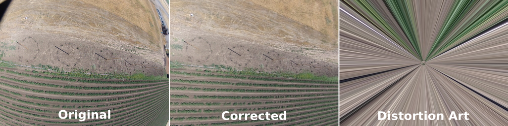

# Lens Correction 
##### (aka Zap-distortion)

A Python script to batch correct photo distortion for a GoPro Hero2 using the Lenfun database. 

Should be adaptable for any camera in the lensfun db.

## Requirements

* Python 3 (Tested with 3.13.3)
* OpenCV (Tested with 4.10.0)
* opencv-python (Tested with 4.11.0)
* Lensfun (Tested with 0.3.4)
* lensfunpy (Tested with 1.17.0)
* piexif (Tested with 1.1.3)
* pillow (Tested with 11.2.1)

See pre.sh for more installation details.

Example

## Usage

1. Install the prequisites
```
#Debian Trixie
sudo apt-get install python3-pip python3-venv python3-opencv liblensfun1
git clone https://github.com/wildintellect/lenscorrection.git
cd lenscorrection
python3 -m venv .
source bin/activate
pip install lensfunpy pillow opencv-python piexif
```
1. Open a terminal in the directory 'lenscorrection'
1. Activate the virtual environment
```
source bin/activate
```
1. Navigate to the directory where you have photos.
1. Run the code
```
/path/to/undistort.py
```
Results will be filename_fix.jpg

## Notes

* Currently only does GoPro Hero2
* Exif is copied from original image except for a few values.
    * Model is set to HD2 U , so you can tell it apart from an unmodified image
    * Focal Length in 35mm is estimated based on the lost amount of image from the original, as the correction crops the edges.

